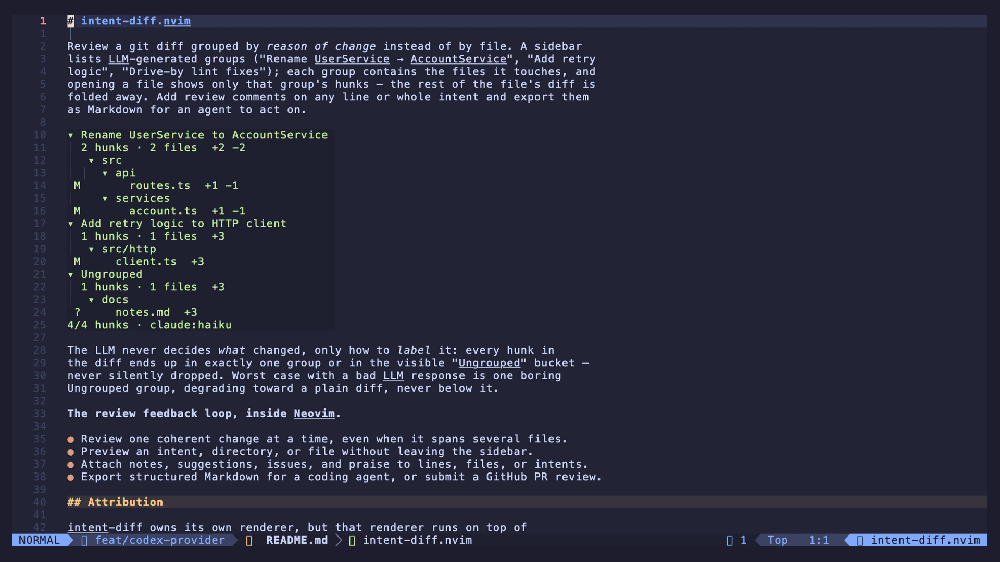

# intent-diff.nvim

**The review feedback loop, inside Neovim.**

Whether code comes from local coding agents or large-scale software factories,
you can review it with the editor you already know and love. intent-diff lets
you move through generated changes using familiar Neovim workflows, while
cutting through the noise so you can focus on what matters.



Instead of presenting a git diff file by file, intent-diff groups its hunks by
the *reason for the change*. Its sidebar turns a large diff into coherent
intents such as "Rename UserService → AccountService", "Add retry logic", or
"Drive-by lint fixes". Open an intent to review only the relevant hunks across
all the files it touches, then leave feedback without stepping out of Neovim.

The LLM never decides *what* changed, only how to *label* it: every hunk in
the diff ends up in exactly one group or in the visible "Ungrouped" bucket —
never silently dropped. Worst case with a bad LLM response is one boring
Ungrouped group, degrading toward a plain diff, never below it.

- Review one coherent change at a time, even when it spans several files.
- Preview an intent, directory, or file without leaving the sidebar.
- Attach notes, suggestions, issues, and praise to lines, files, or intents.
- Export structured Markdown for a coding agent, or submit a GitHub PR review.

## Attribution

intent-diff owns its own renderer, but that renderer runs on top of
**[codediff.nvim](https://github.com/esmuellert/codediff.nvim)** by Yanuo Ma
(MIT). Specifically: codediff's `libvscode-diff` — a C port of VSCode's own
`defaultLinesDiffComputer` — gives intent-diff character-level highlighting
inside changed lines, and its treesitter helper syntax-highlights the synthetic
multi-file buffers. codediff's git plumbing also resolves every reviewed
revision. It is a named runtime dependency rather than vendored code.

Full credits, including VSCode and utf8proc upstream of codediff.nvim itself,
are in [ATTRIBUTION.md](ATTRIBUTION.md).

## Installation

intent-diff requires Neovim 0.10 or newer and
[codediff.nvim](https://github.com/esmuellert/codediff.nvim). The default
grouping provider requires the `claude` CLI on `$PATH`. The built-in Codex
provider requires the `codex` CLI instead; you can also replace either with a
custom provider.
[telescope.nvim](https://github.com/nvim-telescope/telescope.nvim) is
optional: install it and `:IntentDiffFind` fuzzy-finds intents and files;
without it the rest of the plugin works exactly the same.

### `lazy.nvim`

```lua
return {
  {
    "jfojtl/intent-diff.nvim",
    dependencies = {
      "esmuellert/codediff.nvim",
      "nvim-telescope/telescope.nvim", -- optional: enables :IntentDiffFind
    },
    cmd = "IntentDiff",
    opts = {},
    keys = {
      { "<leader>gv", "<cmd>IntentDiff<cr>", desc = "Review changes by intent" },
    },
  },
}
```

### `vim.pack` (Neovim 0.12+)

Add both plugins to `init.lua`, then configure intent-diff after they load:

```lua
vim.pack.add({
  "https://github.com/esmuellert/codediff.nvim",
  "https://github.com/jfojtl/intent-diff.nvim",
})

require("intentdiff").setup()
```

## Use cases

### Review your current work or a revision

Run `:IntentDiff` inside a git repository to review all working-tree changes.
Use `:IntentDiff HEAD~1` for the previous commit, `:IntentDiff main...` for
everything on the current branch since it diverged from `main`, or
`:IntentDiff base target` to compare two explicit revisions. Classification
runs in the background and is cached; press `R` in the sidebar when you want
to classify the diff again from scratch.

### Browse a change by intent

Move through the sidebar to preview an entire intent, one directory, or one
file. Press `<CR>` on a file to move into its diff, use `]c` and `[c` to jump
between hunks, and use `t` to switch between inline and side-by-side layouts.
`za`, `h`, and `l` fold or unfold the current directory or intent; `<Tab>` and
`<S-Tab>` jump between intent headings. Press `gf` to open the real editable
file, `<leader>b` to toggle the sidebar, and `g?` at any time for a cheatsheet
built from your configured keymaps.

Added and untracked files show their real contents. Long new files are split
at blank lines so separate parts can belong to separate intents; deleted files
appear as a single whole-file hunk. Large files automatically fall back to a
hunks-only view when they exceed `line_budget`.

### Find an intent or file

`:IntentDiffFind`, or `<leader>f` from either the diff panes or the sidebar,
opens a Telescope picker over the current review. It lists every intent,
directory, and file, in the same order the sidebar shows them, and one prompt
fuzzy-matches intent titles and file paths together — typing part of an
LLM-written title like "retry" finds "Add retry logic", and typing a filename
finds the file. Selecting an entry closes the picker, renders that target in
the real diff panes, and moves focus into the diff.

This is what makes `<leader>b` (toggle the sidebar) worth using on a small
screen. Hiding the sidebar used to be a dead end — there was no way back to
another intent without showing it again. With the picker, hide the sidebar
for good and navigate entirely through `<leader>f` instead, giving the diff
panes the full width; the side-by-side layout depends on width more than most
buffers do.

The picker's own preview is plain unified diff. Character-level highlighting
and side-by-side alignment exist only in the real panes — the preview is for
orientation while picking, not a substitute for opening the diff.

`:Telescope resume` works normally. A selection is re-resolved by intent
title and file path rather than by list position, so resuming after pressing
`R` to reclassify still lands correctly: if a picked file or directory moved
but its intent is still there, you land on that intent; if the intent itself
is gone, you get a warning instead of a silently wrong diff.

telescope.nvim is optional. Without it, `:IntentDiffFind` and `<leader>f`
notify that `:IntentDiffFind` needs telescope.nvim and do nothing else — the
rest of the plugin is unaffected.

### Leave feedback for a coding agent

Place the cursor on a changed line and press `<localleader>cc`, or visually
select a range first. The popup lets you choose Note, Suggestion, Issue, or
Praise with `<Tab>` and submit with `<C-s>`. The same key on a sidebar intent
adds feedback for the whole intent; `<localleader>cf` adds file-level feedback.
Use `<localleader>ce` and `<localleader>cd` to edit or delete a comment, and
`]n`/`[n` to move between comments. Comments persist for the branch or
revision range being reviewed.

When the review is ready, `<localleader>cy` copies structured Markdown to the
clipboard, `<localleader>cw` writes it to `.intentdiff-review.md`, and
`<localleader>q` copies it and closes the review tab. The export groups every
comment under the intent it belongs to, giving a coding agent both the purpose
of the change and the feedback it needs to address.

### Submit feedback to a GitHub pull request

With the authenticated [`gh` CLI](https://cli.github.com) installed, review
the PR-relative diff with `:IntentDiff origin/main...` and press
`<localleader>cP`. After you choose Approve, Request changes, or Comment,
intent-diff submits one atomic review. When local `HEAD`, the PR head, and the
reviewed base line up, comments are attached inline; otherwise intent-diff
explains why and offers the same feedback as a general PR comment. Submitted
comments are marked locally so a later pass does not post them twice.

### Use Codex

Select the built-in Codex provider to group with `codex exec`. Luna is its
default model; runs are explicitly read-only and ephemeral, while still being
able to inspect the repository for context.

```lua
require("intentdiff").setup({
  provider = "codex_cli",
})
```

Override any Codex CLI default through `provider_opts`:

```lua
require("intentdiff").setup({
  provider = "codex_cli",
  provider_opts = {
    cmd = "codex",
    model = "gpt-5.6-luna",
    timeout_ms = 180000,
    sandbox = "read-only",
    ephemeral = true,
    agentic = true,
  },
})
```

### Use a custom provider

Set `provider` to an asynchronous function if you want to group with another
CLI, an HTTP API, or your own logic. It receives the diff and a numbered hunk
inventory; call the callback with groups whose `ids` refer to those hunk
numbers. Omitted or invalid ids safely land in Ungrouped.

```lua
require("intentdiff").setup({
  provider = function(request, callback)
    -- Static example. For external I/O, call back from async completion.
    callback({
      groups = {
        { title = "Add retry logic", ids = "1-3,7" },
        { title = "Update tests", ids = "4-6" },
      },
    })
  end,
})
```

`request.diff_text` may be `nil` when the diff exceeds
`max_full_diff_bytes`; `request.hunks` is always present and contains each
hunk's `n`, stable `id`, file, and summary lines. `request.repo` identifies
the git root and reviewed revisions. A provider may instead return legacy
`hunk_ids` arrays and may return `{ cancel = function() ... end }` so
intent-diff can stop superseded work. Providers should run asynchronously and
must schedule the callback onto Neovim's main loop when returning from
`vim.system` or another background thread.

## Configuration

Defaults, passed via `opts` (or `require("intentdiff").setup(opts)`):

```lua
{
  -- Grouping provider: a name under intentdiff.providers.*, or a
  -- function(request, callback) — see "Use a custom provider" above.
  provider = "claude_cli",

  -- Options passed to the resolved provider. Each built-in provider starts
  -- from its own defaults; these are the defaults for claude_cli:
  provider_opts = {
    cmd = "claude",        -- CLI binary to run
    model = "haiku",       -- --model passed to `claude -p`
    timeout_ms = 180000,   -- kill the job and report failure after this long

    -- Tool restrictions passed to `claude -p` as --disallowedTools /
    -- --allowedTools (comma-joined). This process runs pointed at the
    -- user's own — possibly uncommitted — working tree, so by default it
    -- can look but not touch: no edits, only read-only git/file access. An
    -- empty list (`{}`) or `nil` omits the corresponding flag entirely
    -- rather than passing an empty value.
    disallowed_tools = { "Edit", "Write", "NotebookEdit" },
    allowed_tools = {
      "Bash(git diff:*)", "Bash(git log:*)", "Bash(git show:*)",
      "Bash(git blame:*)", "Bash(git status:*)", "Read", "Grep", "Glob",
    },

    -- Let the model run those read-only git commands and read files in the
    -- repo on its own, to understand WHY a change was made, instead of
    -- intent-diff pre-stuffing commit messages or `git log` output into the
    -- prompt. The job's cwd is set to the repo root so its commands land in
    -- the right place. Set to `false` to keep the prompt fully
    -- self-contained.
    agentic = true,
  },

  -- Lines of context kept around each visible hunk when computing folds.
  context_lines = 3,

  -- Above this many lines on either side, a file renders hunks-only instead
  -- of its whole content, and says so on its separator. Guards against a huge
  -- generated/vendored file blowing up a diff pane.
  line_budget = 20000,

  -- Width (columns) of the sidebar split.
  sidebar_width = 40,

  -- Wrap long lines in the diff panes. Off, and deliberately so: the two panes
  -- are kept aligned row for row, and a changed line that is 40 characters on
  -- one side and 200 on the other takes one screen row against three — so with
  -- wrapping on, everything below such a line sits at a different height in
  -- each pane. Set to true if you would rather read long lines whole.
  pane_wrap = false,

  -- File icons from nvim-web-devicons (if installed) in the sidebar's file
  -- tree. Silently omitted if the plugin isn't present, or set to false here.
  icons = true,

  -- Auto-open the first file worth looking at instead of leaving the diff
  -- panes empty until you press <CR>: the first file of the flat "All
  -- changes" list while classification is still running, then the first file
  -- of the first real group once it completes. A manual selection (or ]c/[c
  -- navigation) always wins. Focus stays in (or returns to) the sidebar.
  auto_open = true,

  -- Above this diff size (bytes), the prompt sends per-hunk summaries only
  -- (file + the hunk's first 4 lines, then "… (N more lines)") instead of the
  -- full diff text.
  max_full_diff_bytes = 100 * 1024,

  -- Above this many hunks, classification is skipped entirely with a
  -- notice — the sidebar stays in flat file-list mode.
  max_hunks = 600,

  -- Where a finished review can be sent, besides the clipboard and a file.
  -- "auto" picks by the origin remote's host; "github" forces it; a table
  -- implementing the forge interface is used directly; false disables it.
  forge = "auto",
  forge_opts = {
    github = { cmd = "gh", timeout_ms = 30000 },
  },

  -- Added and untracked files arrive from git as a single whole-file hunk, so
  -- they could only ever belong to one intent. Splitting them at blank-line
  -- boundaries lets different parts of one new file land in different
  -- intents, and makes the group fold filter meaningful for them. Set
  -- enabled = false to restore one hunk per added/untracked file.
  added_file_split = {
    enabled = true,
    min_lines = 60,    -- files shorter than this stay a single hunk
    target_lines = 40, -- approximate lines per sub-hunk once split
  },

  -- Where classification results are cached, keyed by diff-text hash.
  cache_dir = vim.fn.stdpath("cache") .. "/intentdiff",

  -- Diagnostics log used by :IntentDiffLog.
  log_file = vim.fn.stdpath("cache") .. "/intentdiff/intentdiff.log",

  -- Cursor-driven navigation: moving the sidebar cursor onto a group or
  -- directory row shows that intent's complete diff in the diff panes, with
  -- a separator per file; moving it onto a file row renders that file's own
  -- diff too.
  preview = {
    enabled = true,
    debounce_ms = 120,  -- cursor settle time before rendering, so scrolling
                        -- past rows doesn't thrash the panes
  },

  -- Optional Telescope picker (:IntentDiffFind / <leader>f). Inert when
  -- telescope.nvim isn't installed.
  telescope = {
    include_dirs = true, -- directory rows alongside intents and files
    preview_lines = 500, -- cap on lines shown in the picker's diff preview
  },

  -- Review comments attached to diff lines and to whole intents, exported as
  -- Markdown for an agent to act on.
  comments = {
    enabled = true,

    -- Comment types, in the order the popup cycles them. Each needs a name
    -- and an icon; its highlight groups are derived from `key` — see
    -- "Highlights" below. A type added beyond the built-in four gets working
    -- (if unstyled) highlight defaults for free.
    types = {
      { key = "note",       name = "Note",       icon = "✍" },
      { key = "suggestion", name = "Suggestion", icon = "💡" },
      { key = "issue",      name = "Issue",      icon = "⚠" },
      { key = "praise",     name = "Praise",     icon = "✨" },
    },

    -- Days before a stored review is swept, so a review left over from a
    -- long-abandoned branch doesn't accumulate under cache_dir forever. Runs
    -- at most once per session, deferred so it never blocks the first
    -- render. false disables the sweep entirely.
    expire_days = 7,

    -- Default path :IntentDiffCommentsWrite offers (and pre-fills with on
    -- repeat use within a session), resolved against the git root when
    -- relative.
    export_path = ".intentdiff-review.md",
  },

  -- Buffer-local keys the plugin installs inside a review tab, namespaced by
  -- surface the way codediff namespaces its own (keymaps.view / .explorer /
  -- .history / .conflict). Set any action to `false` to install nothing. An
  -- action may also be a LIST of keys, all bound to it.
  keymaps = {
    -- The diff panes — one file or a whole intent, same buffers.
    view = {
      quit = "q",
      -- Show/hide the sidebar. Named after (and sharing a default with)
      -- codediff's keymaps.view.toggle_explorer, because our sidebar is that
      -- explorer's counterpart. Installed on the sidebar AND on the diff
      -- panes, since a sidebar-only key is unreachable once the sidebar is
      -- hidden.
      toggle_sidebar = "<leader>b",
      next_hunk = "]c",       -- group-scoped: only this intent's hunks
      prev_hunk = "[c",
      show_help = "g?",
      -- The panes are read-only scratch buffers; this is the only way from
      -- one into the real, editable file, at the cursor's exact line. Opens
      -- in a new tab. No collision with the sidebar's own `gf` (goto_file) —
      -- a different surface, a different buffer.
      open_file = "gf",
      -- Fuzzy-find any intent, directory, or file with Telescope. Installed
      -- on the sidebar too, since the picker's whole point is being reachable
      -- with the sidebar hidden. No-op with a notice when telescope.nvim
      -- isn't installed.
      find = "<leader>f",
    },
    -- The intent sidebar.
    sidebar = {
      select = "<CR>",
      quit = "q",
      reclassify = "R",       -- what codediff's explorer uses
      goto_file = "gf",
      next_group = "<Tab>",
      prev_group = "<S-Tab>",
      show_help = "g?",
      -- Vim-style folds, matching codediff's explorer set. On a directory row
      -- these act on that directory; anywhere else in an intent (title, stats
      -- line, file row) they act on the enclosing intent. "Recursive" means
      -- the row plus every directory beneath it.
      fold_open = { "zo", "l" },
      fold_open_recursive = "zO",
      fold_close = { "zc", "h" },
      fold_close_recursive = "zC",
      fold_toggle = "za",
      fold_toggle_recursive = "zA",
      -- Whole-sidebar. Per-directory state is deliberately preserved, so
      -- re-expanding restores the tree you had arranged.
      fold_open_all = "zR",
      fold_close_all = "zM",
      -- Collapse every intent if any is expanded, else expand every one.
      -- Unbound by default (`zR`/`zM` do the two halves explicitly) and
      -- reachable as :IntentDiffToggleAll.
      fold_toggle_all = false,
      find = "<leader>f",
    },
    -- Review comments. Cross-surface by nature: an intent comment is added
    -- from a sidebar group row, a line comment from a diff pane row, and both
    -- surfaces need the export keys — so this is installed on both.
    comments = {
      add_comment = "<localleader>cc", -- pick the type in the popup
      add_note = "<localleader>cn",
      add_suggestion = "<localleader>cs",
      add_issue = "<localleader>ci",
      add_praise = "<localleader>cp",
      add_file_comment = "<localleader>cf", -- an intent comment on a group row
      edit_comment = "<localleader>ce",
      delete_comment = "<localleader>cd",
      list_comments = "<localleader>cl",
      next_comment = "]n",
      prev_comment = "[n",
      export_clipboard = "<localleader>cy",
      export_file = "<localleader>cw",
      clear_comments = "<localleader>cx",
      -- The review.nvim end-of-review flow: copy, then close. Plain `q`
      -- still closes without touching the clipboard.
      export_and_close = "<localleader>q",
      submit_review = "<localleader>cP",
      -- Popup-local keys for the comment entry float, buffer-local to its
      -- text area rather than tab-wide.
      popup_cycle_type = "<Tab>",
      popup_submit = "<C-s>",
      popup_cancel = "q",
    },
  },
}
```

## Diagnostics

`:IntentDiffLog` opens the diagnostics log (`config.log_file`) in a scratch
buffer, cursor at the end so the newest entry is visible. Every classification
appends timestamped entries covering:

- **Provider invocations** — the command+args spawned, prompt size, hunk
  count, elapsed time, exit code, the first ~400 bytes of stdout and stderr,
  and how the response parsed.
- **Classification outcomes** — cache hit, re-match against the previous
  classification, skipped for exceeding `max_hunks`, or provider
  success/error.
- **Reconciliation stats** — total inventory hunks, how many the provider
  assigned, how many ids were unrecognized or duplicated, how many landed in
  Ungrouped, and `id_mapping_failures` for compact responses.

The log file is capped at roughly 200KB, truncating the oldest entries on
write.

## License

MIT — see [LICENSE](LICENSE). Every dependency it builds on is MIT too; the
per-component copyright notices are in [ATTRIBUTION.md](ATTRIBUTION.md).
